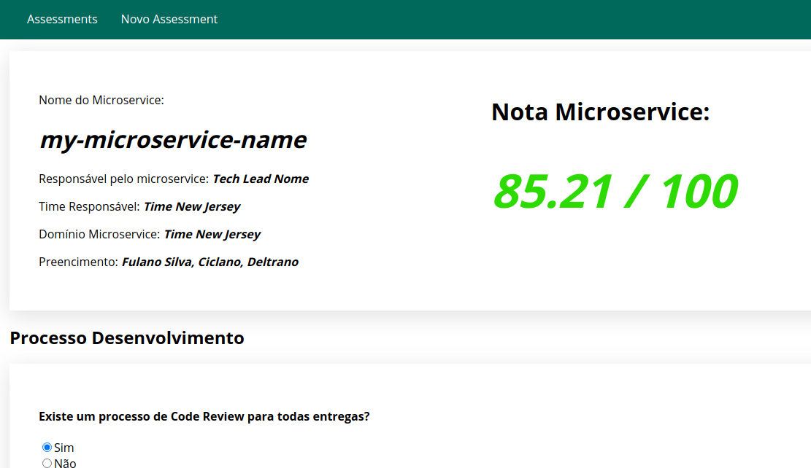

# ms-assessment (doing)
A simple web application to register microservice application assessment using a survey form.

## How To Run
cd ms-assessment && sh run.sh

The web application will be running on https://localhost:3000

## Database MongoDB

Mongo Express UI: http://localhost:8011/

## Screen Assessment Result

